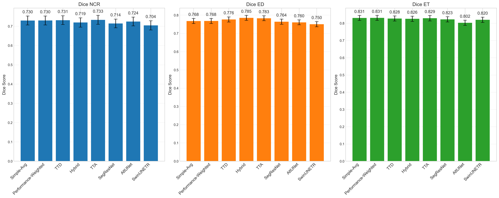
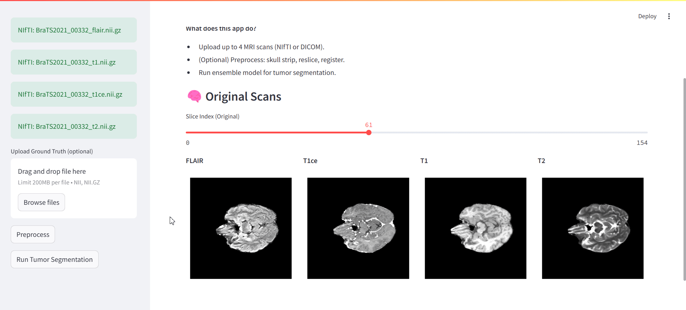

# UPC Master Thesis 2024 / 2025

> **Towards Reliable Brain Tumor Segmentation in MRI Neuroimaging**  
> **Integrating Uncertainty Estimation and Ensemble Methods for Clinical Applications**

This repository contains the code, data‑preparation steps, experiments and web‑app for my UPC MSc thesis. I develop and evaluate an uncertainty‑aware ensemble of four state‑of‑the‑art 3D deep‑learning models for brain tumor segmentation in multimodal MRI, and integrate it into an interactive clinical web application.

The full thesis is available at: https://hdl.handle.net/2117/430325

---

## 📑 Table of Contents

1. [Project Overview](#-project-overview)  
2. [Folder Structure](#-folder-structure)  
3. [Getting Started](#-getting-started)  
   - [Requirements](#requirements)  
   - [Installation](#installation)  
4. [Usage](#-usage)  
   - [Training](#1.-training)  
   - [Inference](#inference)  
   - [Web App](#web-app)  
5. [Results](#-results)
6. [Web App Demo](#-web-app-demo)

---

## 🚀 Project Overview

Accurate brain tumor segmentation in MRI is essential for diagnosis, treatment planning, and monitoring. However, deep‑learning models can be over‑confident and fail silently—especially on rare tumor subregions or out‑of‑distribution scans.

**Contributions:**  
- Trained four 3D CNN/Transformer architectures (V‑Net, SegResNet, Attention U‑Net, SwinUNETR) via 5‑fold cross‑validation  
- Fused them with three ensemble strategies:  
  1. Simple averaging  
  2. Performance‑weighted averaging  
  3. Performance + uncertainty‑weighted averaging  
- Incorporated voxel‑wise uncertainty estimation (epistemic & aleatoric)  
- Wrapped everything into an interactive web app for clinical review  

---

## 📂 Folder Structure
```bash
├── EDA                              ← Exploratory data analysis notebooks
├── hyperparameter_tuning_results    ← Hyperparameter search outputs (logs, plots)
├── other                            ← Miscellaneous scripts & notes
└── src                              ← All source code
    ├── brain_seg_app                ← Streamlit web application
    ├── calibration                  ← Probability calibration routines
    ├── config                       ← Config files
    ├── dataset                      ← Data loaders & preprocessing
    ├── ensemble                     ← Ensemble‑fusion code
    ├── models                       ← Model definitions (V‑Net, SegResNet, etc.)
    ├── ood_samples                  ← Out‑of‑distribution test cases
    ├── stats                        ← Statistical analysis scripts
    ├── train                        ← Training & hyperparameter tuning scripts
    ├── uncertainty                  ← Uncertainty estimation methods and evaluation
    ├── utils                        ← Utility functions
    └── visualization                ← Plotting & figure generation
```

## 🛠 Getting Started

### Requirements

- Python 3.10+  
- PyTorch 2.3.1+  
- MONAI 1.3.2+  
- see `requirements.txt` for full list  

### Installation

1. **Clone this repo**

   ```bash
   git clone https://github.com/m-agata/thesis_tumor_segmentation.git
   cd thesis_tumor_segmentation
   ```
3. **Create & activate a virtual‑env**
   ```bash
   python -m venv venv
   source venv/bin/activate
   ```
4. **Install dependencies**
   ```bash
   pip install -r requirements.txt
   ```

## ⚙️ Usage
1. **Training**
   All training scripts live in `src/train`. To launch a 5-fold cross-validation for hypertuning a model, e.g., a V-Net:
   ```bash
   cd src/train/
   python hyperparameter_tuning.py --model_name vnet   
   ```
2. **Inference**
   To run inference using one of four single model available (vnet, attunet, segresnet, swinunetr):
   ```bash
   cd src/models
   python predict_case.py --model vnet --out ../models/predictions
   ```
   If you want to predict a single case:
   ```bash
   python predict_case.py --model vnet --patient 00332 --out ../models/predictions
   ```
   To run inference using an ensemble model using one of five ensemble strategies (simple, perf, tta, ttd, hybrid):
   ```bash
   cd src/ensemble
   python run_ensemble.py --method hybrid --output-path ./results/hybrid_ens --n-iter 20 --patient-id 00332
   ```
   
4. **Web app**
   To launch the clinical toolbox prototype:
   ```bash
   cd src/brain_seg_app
   python -m streamlit run app.py
   ```

## 📈 Results
Dice scores for each model:



## 🎬 Web App Demo
Below is a quick demo of the interactive segmentation interface:

1. **Upload your MRI scans**
   


3. **Run the segmentation and uncertainty estimation**


   
5. **Explore results slice‑by‑slice and download them if you want**


